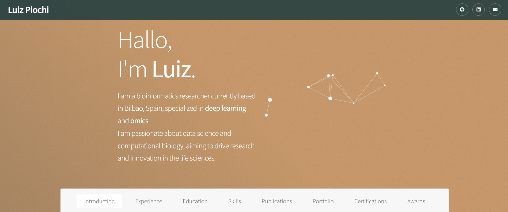
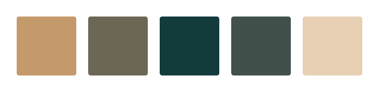
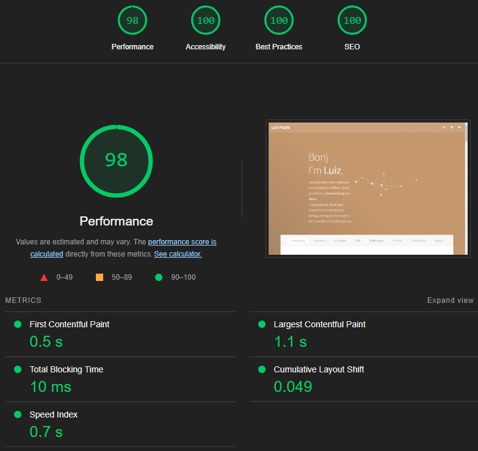

# LF Piochi's online portfolio

## About
Rather simple webpage I built to showcase my online curriculum and portfolio, available on [lupiochi.github.io](lupiochi.github.io). Hosted by [GitHub pages](https://pages.github.com/).

## Theme
The website uses a custom-designed theme with the following color palette:

- Primary Color: #C4996B
- Secondary Color: #6C6755
- Accent Color: #133B3C
- Background Color: #42504B
- Text Color: #E7D0B4

##  Performance
The website has been optimized for performance, accessibility, best practices, and SEO, achieving high scores in [Google Lighthouse](https://developer.chrome.com/docs/lighthouse/) audits.

Full JSON report here: [JSON Report for lupiochi.github.io](assets/docs/lighthouse.json)

## License
This repo is under the MIT License, you can use any of its components as long as you acknowledge its authors.

This was the first website I've built. I did my best to comply with performance and good practices I found online, and am quite proud of what I managed to design in a few days.
